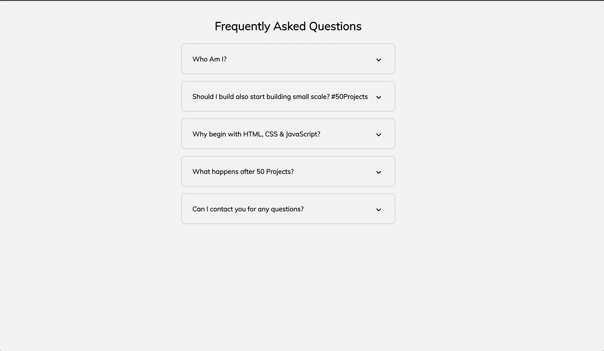
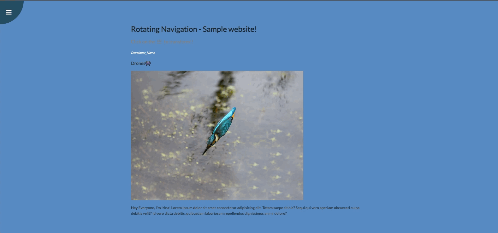

# Daily Challenges to keep practicing coding! #
- The idea behind this is to make small but challanging projects everyday to keep up with practicing coding. The challanges in the later stages will get exponentially bigger, and branch out to working with framworks such as React, Vue and Angular, and written entirely in TypeScript or JavaScript. In the future, I am planning on teaching myself one variant of the C languages (C++ / C#).

## Technologies I used and practiced
Updated soon...

## Day 1: Analogue Clock with date (Month, day and Year)
Preview:  

## Day 2: Image Slider
Preview:  

## Day 2.5 (extra): List of movies (API, DOM manupilation etc.,)
Preview:  

## Day 3: Simple FAQ website with dropdown features
Preview:  

## Day 4: Expanding Panes with Birds
Preview:  

## Day 5: Rotating Hambuerger with Sample Website
Preview:  